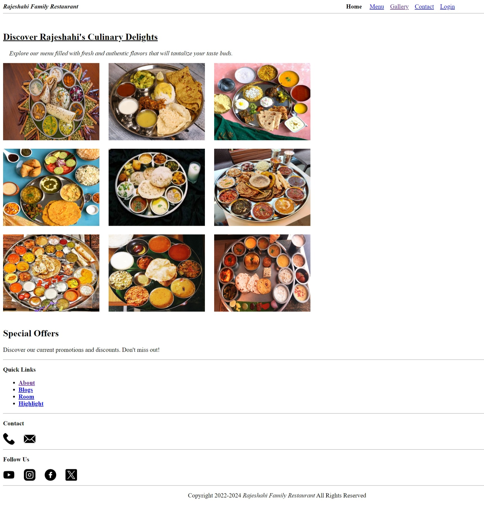
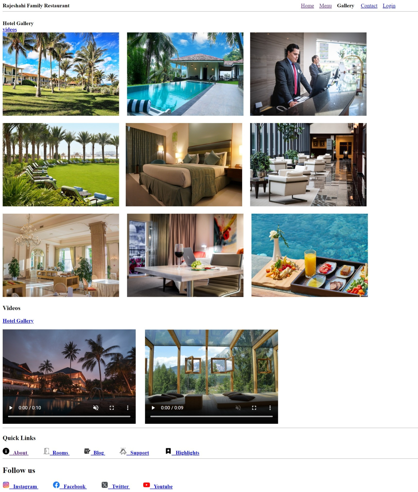
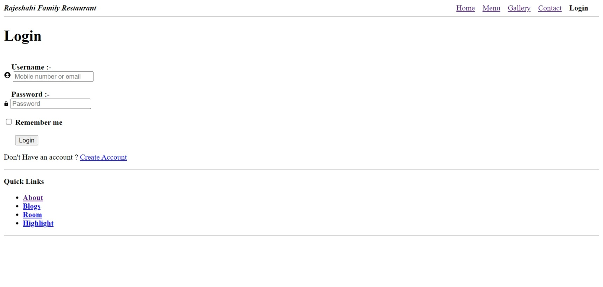
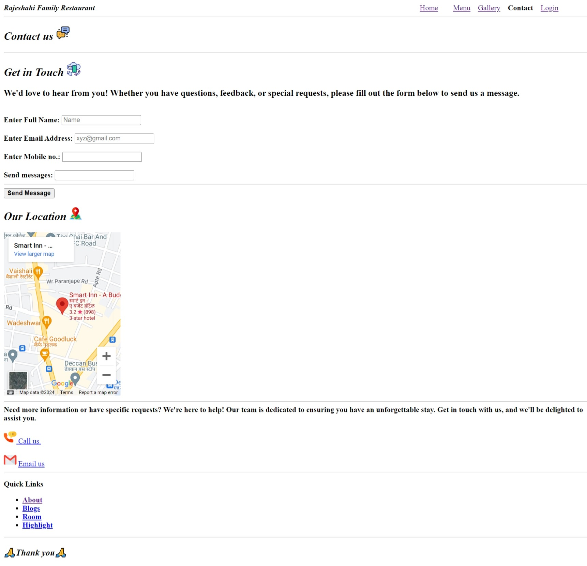

 # Project title :-Rajeshahi Family Restaurant 💖
 ## 1 Home page 

---
##  2 Gallery page

---
## 3 Login page

---
## 4 Contact page

---

## Project Description

*Rajeshahi Family Restaurant  is a fictional restaurant website designed to showcase the restaurant's menu, services, and ambiance. The website aims to provide an engaging and user-friendly experience for customers to explore and learn about the restaurant.*

## Features
- Homepage with food  image and intro message .
- Menu page with categories and dish descriptions .
- Contact page with address, phone number, and email-id.
- Gallery page with images of dishes and restaurant interior .
- About page with restaurant history and mission statement .

## Goals 
- Create a visually appealing and easy-to-navigate website.
- Showcase the restaurant's menu and services .

## Technologies used
- HTML 5

---

## Message for customer 

**This wedsite highlight the restaurant main features and goal of the restaurant .The website aims to provide an engaging and user-friendly experience for customers to explore and learn about the restaurant.**

---

## contributer :

 -  We would like to extend our gratitude to the following individuals who have contributed to this project

- Their contributions have been invaluable to the success of this project, and we appreciate their time and effort.

---

 

---

*Copyright 2022-2024 Rajeshahi Family Restaurant All Rights Reserved*

---

                Thanks for visiting  🙏🙏

                    .... 🙏🙏🙏....